# Sync Worksheet to Record

Menu Command

## Version

1.0.2 - 01/07/2026

This plug-in is written in Vectorscript (Pascal) and can be used in any version of [Vectorworks](https://www.vectorworks.net) 2019 or newer.

## Description

This menu command can be used to synchronize a Worksheet, such as a referenced Excel document, to a Record Format, such as Record data attached to Symbols or Parametric Records to control Plug-in Objects.

This process is achieved through what this command refers to as **Sync Sets**, special records attached to the Worksheet that map Worksheet columns to Record Fields and define boolean Record Field behavior.

## Sync Set Types

**Sync Sets** have two types:

1. **Objects on Layer**: This type will search for objects on Design Layers or Sheet Layers with the chosen Record attached. Think of this as focusing on objects in drawing space.
2. **Symbol Definitions**: This type will search Symbol Definitions within the Resource Manager, useful for managing default values for Symbols with attached Records.

## Instructions

1. Run the **Sync Worksheet to Record** menu command.
2. If no **Sync Sets** are detected in the active drawing, the **Manage Sync Sets** dialog will launch.
3. Specify the **Sync Set** name, Worksheet, and Sync Type.
4. Specify a Record Format to synchronize to the chosen Worksheet.
5. Specify the Worksheet row containing the column headers.
6. Specify a Worksheet **Key Column**. The data of this column will be used to match objects with the linked Record Field value.
7. Select a column to link to Record Field.
8. Select a Record Field to complete the link. The selected Record Field should appear in the **Linked Field** column of the selected item in the **Worksheet Data** box.
9. Specify the **Boolean Settings**. When a boolean Record Field is set to **True**, the Worksheet will match to the text entered in the **True** field (such as "`Yes`" or "`X`").
10. Press **OK** to close the dialog and create the **Sync Set**.
11. Once a **Sync Set** is created, the **Sync Worksheet to Record** dialog should open, showing found discrepancies between the Worksheet and the Record values.
12. For each discrepancy, choose the "source of truth", whether it's the Worksheet (placing a checkmark in the **WS** column), the Record (placing a checkmark in the **Record** column), or if the discrepancy should be ignored (placing a "no sign" in the **Ignore** column).
13. Press the **OK** button to complete the synchronization and update the Worksheet values / objects with the chosen Record attached.

## Dialog Box Explanation

### Manage Sync Sets

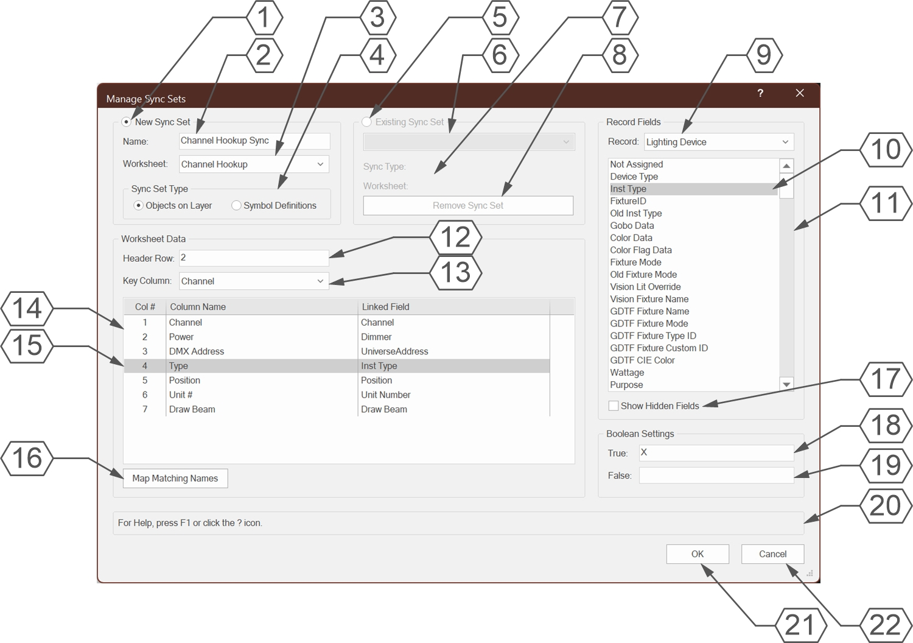

1. Select **New Sync Set** to create a new **Sync Set**.
2. Enter a name for the **Sync Set**. This field cannot be left blank.
3. Select a Worksheet for the **Sync Set**.
4. Select the [Sync Set Type](#sync-set-types).
5. Select **Existing Sync Set** to edit and existing **Sync Set**.
6. Select a **Sync Set** to edit.
7. The linked Worksheet and Sync Type for the chosen **Sync Set** will be displayed here.
8. Press **Remove Sync Set** to remove the selected **Sync Set** from the drawing. This action will not be completed until the dialog **OK** button is pressed.
9. Select a Record Format to sync with the chosen Worksheet. This can be a document Record Format or a Plug-in Object Parametric Record.
10. The Linked Field for the selected Worksheet column will be <mark style="background-color: blue; color:white">highlighted</mark> in the List Box. If a Worksheet column does not have a Linked Field value, the <mark style="background-color: blue; color: white">Not Assigned</mark> item will be selected.
11. All Record fields for the chosen Record Format will appear in this List Box.
12. Enter the Worksheet row containing the column header titles.
13. Select the Worksheet column used to match objects with the attached Record. This column *MUST* have a value in the **Linked Field** column.
14. Worksheet columns and values will populate in this browser for the selected Worksheet and Worksheet row.
15. The currently selected Worksheet column will be <mark style="background-color: blue; color: white">highlighted</mark>.
16. Press **Map Matching Names** to map unlinked Worksheet column names with matching Record Field names. This will ignore capitalization.
17. Check **Show Hidden Fields** to display Record Fields starting with a double underscore ("**__**"). These fields are typically used in Plug-in Objects for parameters not visible in the Object Info Palette.
18. Enter a value to associate with a **True** boolean value. In this case, if the **Draw Beam** field is checked for the Lighting Device object, the Worksheet value will be shown as "`X`".
19. Enter a value to associate with a **False** boolean value. In this case, if the **Draw Beam** field is not checked for the Lighting Device object, the Worksheet value will be blank.
20. **Help Box**, mousing over any dialog box element will display the explanation here.
21. Press **OK** to save the **Sync Set** and finalize **Sync Set** removal.
22. Press **Cancel** to close the dialog box without changing **Sync Sets**.

### Sync Worksheet to Record

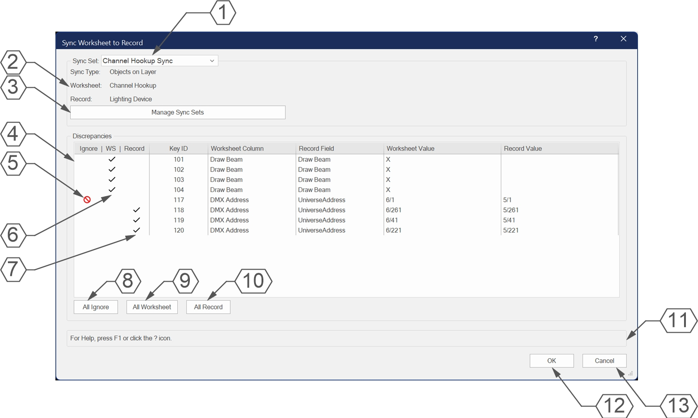

1. Select a **Sync Set**.
2. **Sync Set** information such as **Sync Type**, **Worksheet**, and **Record Format** for the selected **Sync Set** will appear here.
3. Press **Manage Sync Sets** to open the **Manage Sync Sets** dialog box for the selected **Sync Set**.
4. Discrepancies between Worksheet and Record values will populate this browser. The browser can be sorted by any column, with sorting by **Key ID** by default.
5. To ignore a discrepancy, place a "no sign" in the **Ignore** column. **Ignore** is the default for all discrepancies when the dialog is first opened.
6. To synchronize the Record Field to the Worksheet value, place a checkmark in the **WS** column.
7. To synchronize the Worksheet value to the Record Field, place a checkmark in the **Record** column.
8. Press **All Ignore** to set all discrepancies to **Ignore**.
9. Press **All Worksheet** to set all discrepancies to **WS**.
10. Press **All Record** to set all discrepancies to **Record**.
11. **Help Box**, mousing over any dialog box element will display the explanation here.
12. Press **OK** to synchronize Worksheet values and objects with attached Records for discrepancies not marked **Ignore**.
13. Press **Cancel** to close the dialog box without synchronizing Worksheet and Record Values.

## Examples

### Creating and Managing a Channel Hookup

We will use the **Sync Worksheet to Record** command to create a simple Channel Hookup for existing Lighting Device objects and then update those objects through a worksheet.

**1**. First, we'll rough in a quick Worksheet, filling in only the *Channel* column which will also serve as the Worksheet key.

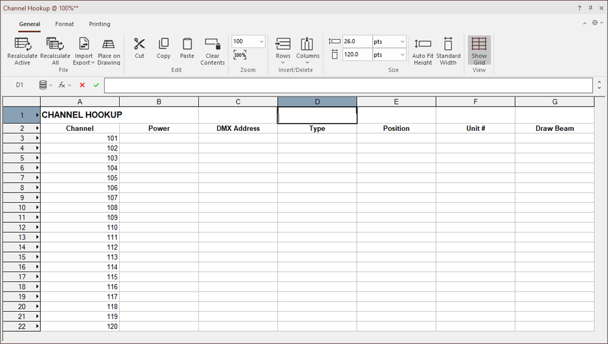

**2**. Next, we'll want to make sure that all of the Worksheet fields are set to be *Text* rather than *General* to prevent DMX Addresses from being converted to scientific notation.

**3**. We'll launch the **Sync Worksheet to Record** command. Since we haven't yet built a **Sync Set** in this drawing, this will launch the **Manage Sync Sets** dialog first.

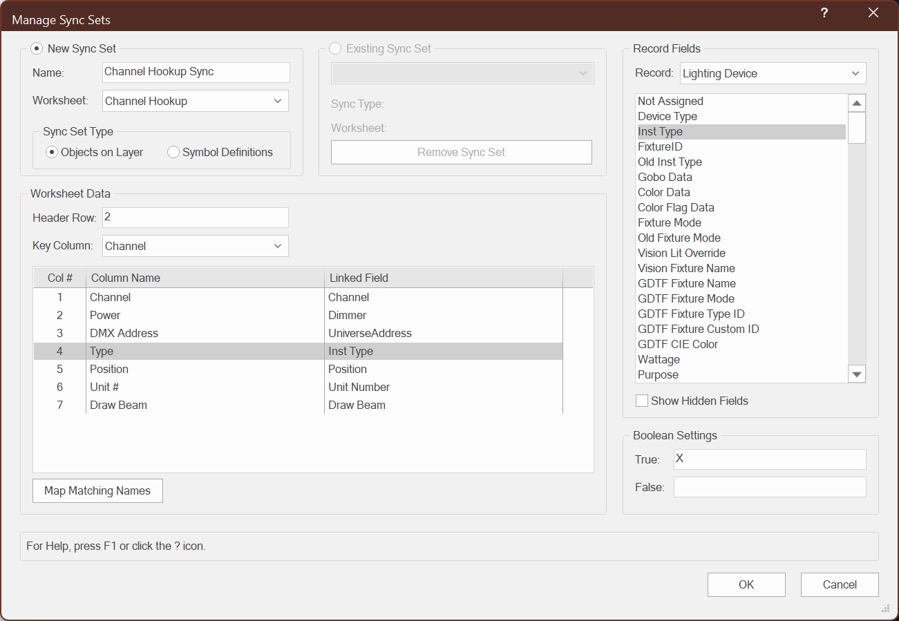

**4**. We'll fill in the information for the **Sync Set**. Because our header columns are on row 2, we'll make sure the **Header Row** field reads `2`. We can use the **Map Matching Names** button to map the *Channel*, *Position*, and *Draw Beam* fields, then use the Browser and Record Fields List Box to map the remaining values. Lastly, we'll set the **True** value to `X` and the **False** value to blank so that we can control whether the beam is drawn by filling in `X` in the Worksheet.

**5**. Once we're satisfied with the **Sync Set** settings, we'll press **OK** to save the **Sync Set**. The **Sync Worksheet to Record** dialog will now open for the newly created **Sync Set**.

**6**. Since the Worksheet is empty aside from the *Channel* field, we should see discrepancies populate with the Lighting Device Record data. We can press the **All Record** button to set all discrepancies to sync to the Record data. We can press **OK** to finish the synchronization process.

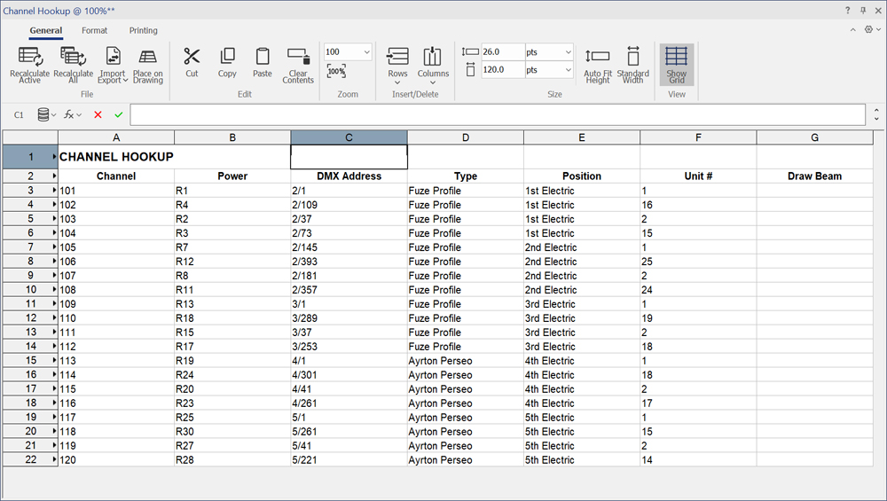

**7**. Now let's say that we need to move *Channels* 117-120 to be on Universe 7, and also want to turn the beams on to check their shots. We'll update the Worksheet with the new *DMX Address* information and put a `X` in the *Draw Beam* column. When we run the **Sync Worksheet to Record** command, we'll see the new discrepancies. We are currently driving from the Worksheet, so we can press **All Worksheet** to sync the Lighting Device objects to the Worksheet.

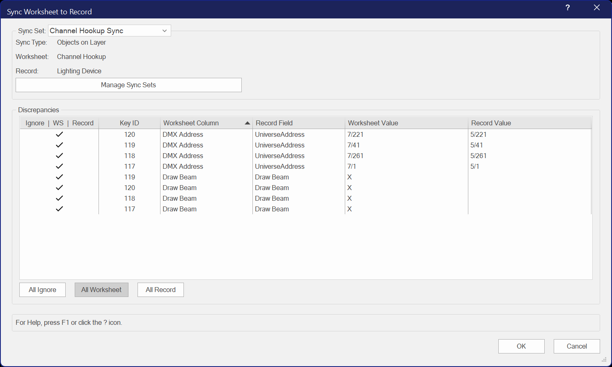

**8**. Once we press **OK**, the four Lighting Device objects will be updated with the new universe and the **Draw Beam** checkbox will be checked in the Object Info Palette.

### Managing Light Info Record Values

We can also use the **Sync Worksheet to Record** command to manage Records attached to Symbol Definitions, such as the **Light Info Record** used for setting default values for Lighting Device objects.

**1**. First, we're going to build a new Worksheet for the Lighting Devices we want to manage, using the Symbol name as the key column.

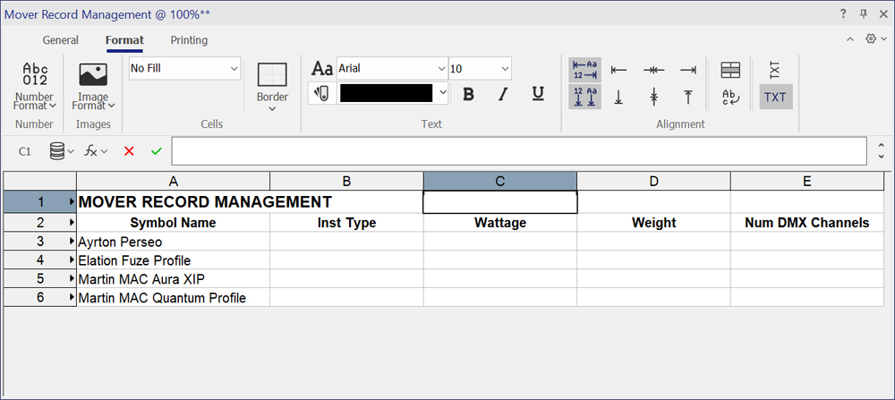

**2**. Next, we'll build the new **Sync Set** by running the **Sync Worksheet to Record** command and pressing the **Manage Sync Sets** button.

**3**. This will be a new **Sync Set**, so we'll select the **New Sync Set** option and begin filling in the information.

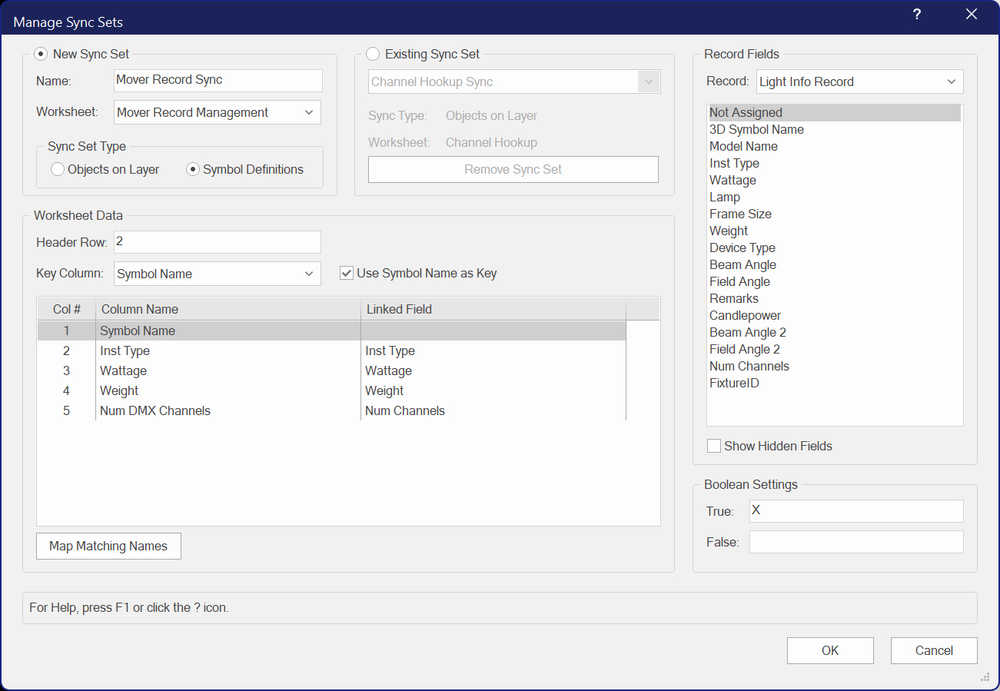

**4**. In this case, we'll be using the Symbol Name as the key, which does not exist within the **Light Info Record**. So we'll check the **Use Symbol Name as Key** checkbox, which is only visible when editing **Sync Sets** with the **Symbol Definitions** type. This allows us to leave the *Linked Field* column of the Key Column as <mark style="background-color: blue; color: white">Not Assigned</mark>.

**5**. Once we press **OK** to finalize the **Sync Set**, we'll once again see discrepancies for all empty Worksheet values.

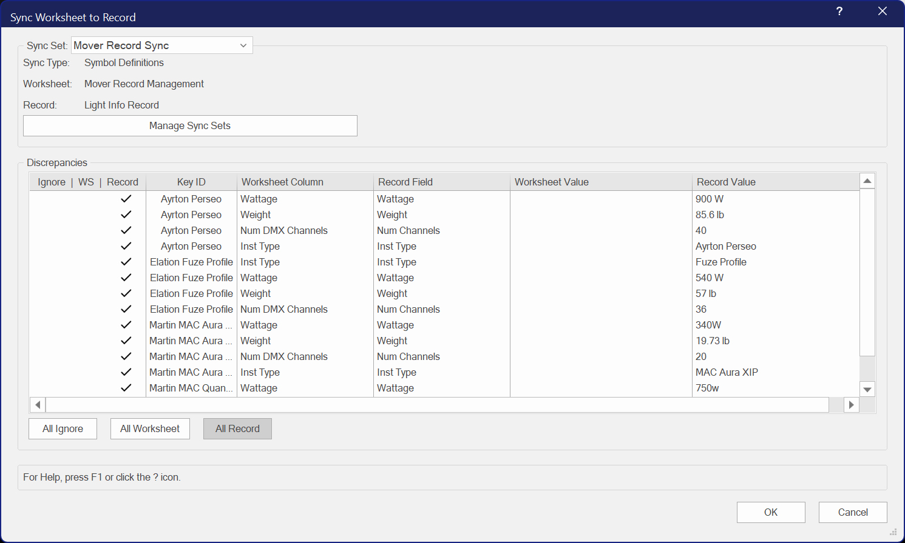

**6**. Our Worksheet is now fully populated with data from the **Light Info Record**. However, we also see that the *Weight* field is missing from the Martin MAC Quantum Profile.

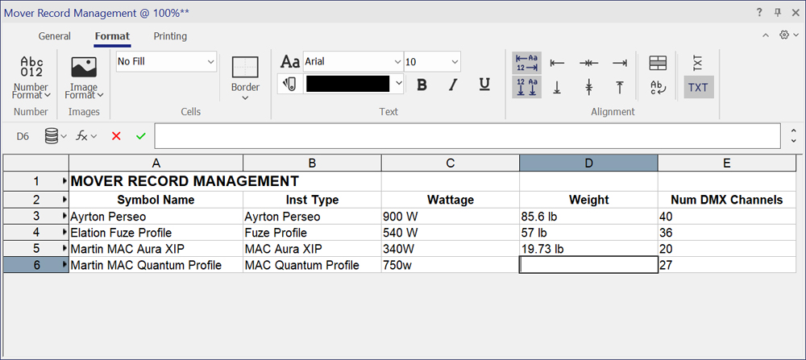

**7**. So we will in the missing *Weight* data in the worksheet and run the **Sync Worksheet to Record** command again.

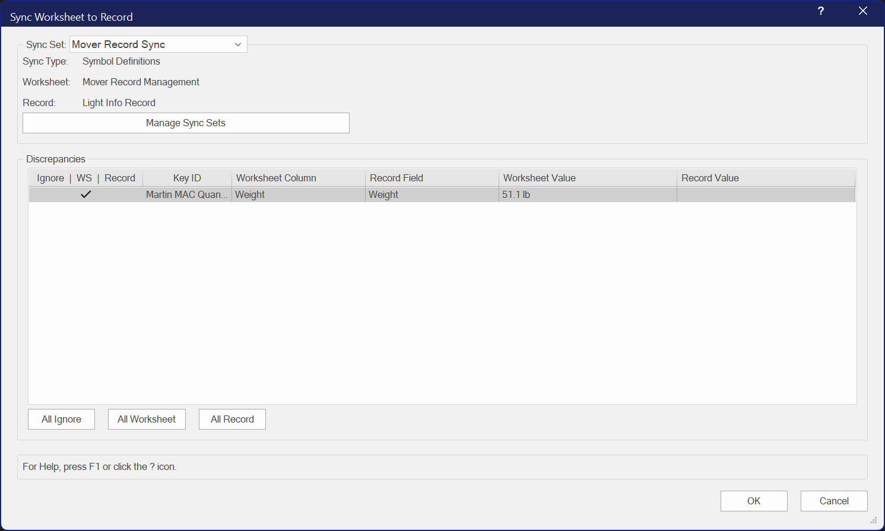

**8**. After pressing **OK** to synchronize to the Worksheet value, we see that the Symbol's attached Record has been updated.

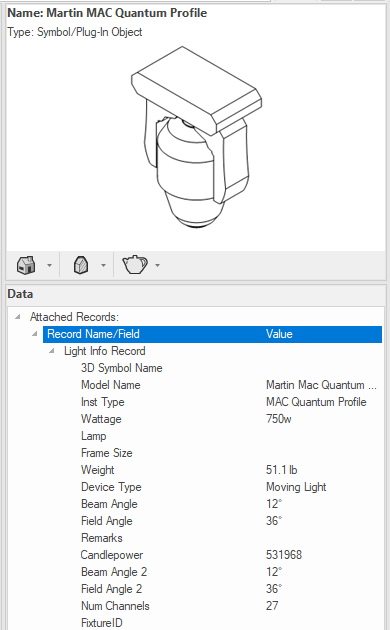

## Note When Using with Excel Referenced Worksheets

When the chosen Worksheet is a referenced Excel document, please note that synchronizing with this command *WILL NOT* flag the Worksheet as changed. The **Push Data to Excel File** will be grayed out. Manually change a value in the Worksheet to get the **You are about to edit a worksheet that is referenced...** dialog and select the **Edit this worksheet** option. Then change the value back to the correct value. You should then be able to select the **Push Data to Excel File** option.

## Installation Instructions

There are two methods of installation, direct download of the plug-in or through the **JNC Tools Free Manager** plug-in.

### Direct Download:

1. Download [source plug-in file](Sync%20Worksheet%20to%20Record.vsm)
2. Place downloaded file inside the **Vectorworks User Folder** within the **Plug-ins** directory
3. Restart Vectorworks

### JNC Tools Free Manager

1. Run the [**JNC Tools Free Manager**](https://jncogs.github.io/JNC-Tools-Manager-Free/) menu command
2. Select the **Sync Worksheet to Record** command
3. Press the **Install / Update** button
4. Press **Close** to close the dialog box
5. Restart Vectorworks

## Adding the Plug-in to your Workspace

1. Open the **Workspace Editor** by going to **Tools - Workspaces - Edit Current Workspace**
2. Select the **Menus** tab
3. In the box on the left, find and expand the **JNC** category
4. In the box on the right, find a suitable menu to place the command in, such as **Tools** or **Modify**
5. Click and drag the **Sync Worksheet to Record** command from the box on the left to the desired menu location in the box on the right
6. Click **OK** to close the editor

## Localization Instructions

The plug-in can be localized to your native language without having access to the source code.  This can be achieved by following the instructions below:

1. Open the **Plug-in Manager** by going to **Tools - Plug-ins - Plug-in Manager**
2. Select the **Third-party Plug-ins** tab
3. Select the **Sync Worksheet to Record** command
4. Click the **Customize** button
5. Select the **Strings** tab
6. Double-click a category, such as **Dialog Strings**
7. Select a string to edit and press the **Edit** button
8. Write a new string and press the **OK** button until you are back to the **Plug-in Manager**

The categories for this plug-in are as follows:

- **3000** - *Dialog Strings*: These strings are used in the dialog box elements and can all freely be changed.
- **4000** - *Dialog Help Strings*: Thse strings are used in the **Help Box** at the bottom of the dialog boxes and can all freely be changed.
- **5000** - *Misc Strings*: These strings serve multiple purposes in the code, but are mostly Alerts that appear in dialog boxes. Do not change **5000** - **5003** or **5005** and **5006**, but all others can be changed.
- **6000** - *Record Strings*: These strings are used for the embedded **Sync Set** record and *should not* be changed to ensure compatibility between different users.

## Release Notes

| Date | Version | Note |
| :---: | :---: | :--- |
| 12/26/2025 | 1.0.0 | Initial release |
| 12/27/2025 | 1.0.1 | Focus on Name field any time New Sync Set has been selected |
| 01/07/2026 | 1.0.2 | Fixed bug with Record Field list box causing Mac machines to hang |

## Known Bugs

No Known Bugs

## Feature Requests

| Date Logged | Request |
| :---: | :--- |
| 01/07/2026 | Add ability to use a Record Field outside of the synced Record for Key |

## License

Copyright (c) Jesse Cogswell (JNC Tools)

Permission is hereby granted, free of charge, to any person or organization
obtaining a copy of this software (the "User") and associated documentation files (the "Software"),
to use, reproduce, distribute, execute, and transmit the Software.

The User is not permitted to modify or attempt to reverse engineer the source code.  The User may
localize the Software using approved methods from within the Vectorworks software.

THE SOFTWARE IS PROVIDED "AS IS", WITHOUT WARRANTY OF ANY KIND, EXPRESS OR
IMPLIED, INCLUDING BUT NOT LIMITED TO THE WARRANTIES OF MERCHANTABILITY,
FITNESS FOR A PARTICULAR PURPOSE, TITLE AND NON-INFRINGEMENT. IN NO EVENT
SHALL THE COPYRIGHT HOLDERS OR ANYONE DISTRIBUTING THE SOFTWARE BE LIABLE
FOR ANY DAMAGES OR OTHER LIABILITY, WHETHER IN CONTRACT, TORT OR OTHERWISE,
ARISING FROM, OUT OF OR IN CONNECTION WITH THE SOFTWARE OR THE USE OR OTHER
DEALINGS IN THE SOFTWARE.